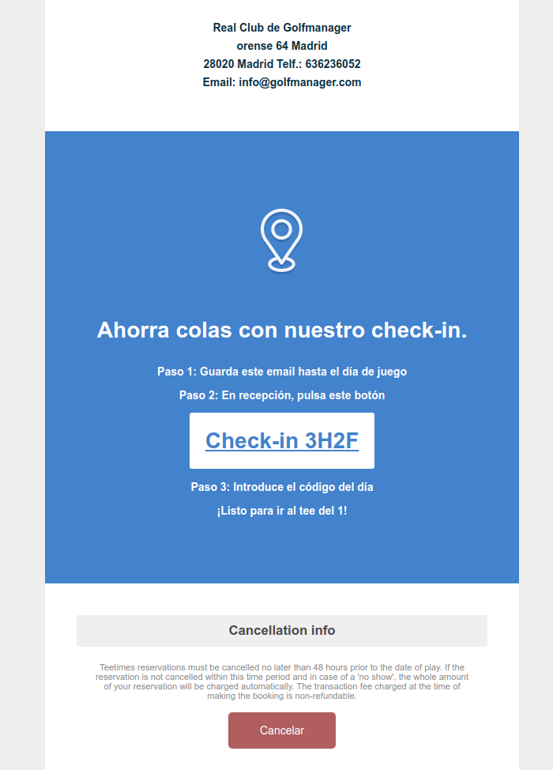

       
# Auto Check-in

The function signature:

```typescript
export function getEmailButtons(sale: billing.Sale, style?: string) 
```

To call it from a template:

```html
<%== runtime.exec('autocheckin.getEmailButtons', model.sale) %>
```

A complete example with styles:    

```html
<h1 style="background-color: #4382cc; color: #fff; padding: 50px 15px 70px 15px; margin: 0;">
    
    <p style="font-size: 1em;">Ahorra colas con nuestro check-in.</p>
    <p style="font-size: 0.5em;">Paso 1: Guarda este email hasta el día de juego</p>
    <p style="padding-bottom: 20px; font-size: 0.5em;">Paso 2: En recepción, pulsa este botón</p>
    <%== runtime.exec('autocheckin.getEmailButtons', model.sale, "border-radius: 3px; background-color: #fff; color: #4382cc; padding: 20px 20px; font-size: 1em;") %>
    <p style="padding-top: 20px; font-size: 0.5em;">Paso 3: Introduce el código del día</p>
    <p style="font-size: 0.5em;">¡Listo para ir al tee del 1!</p>
</h1>
```


